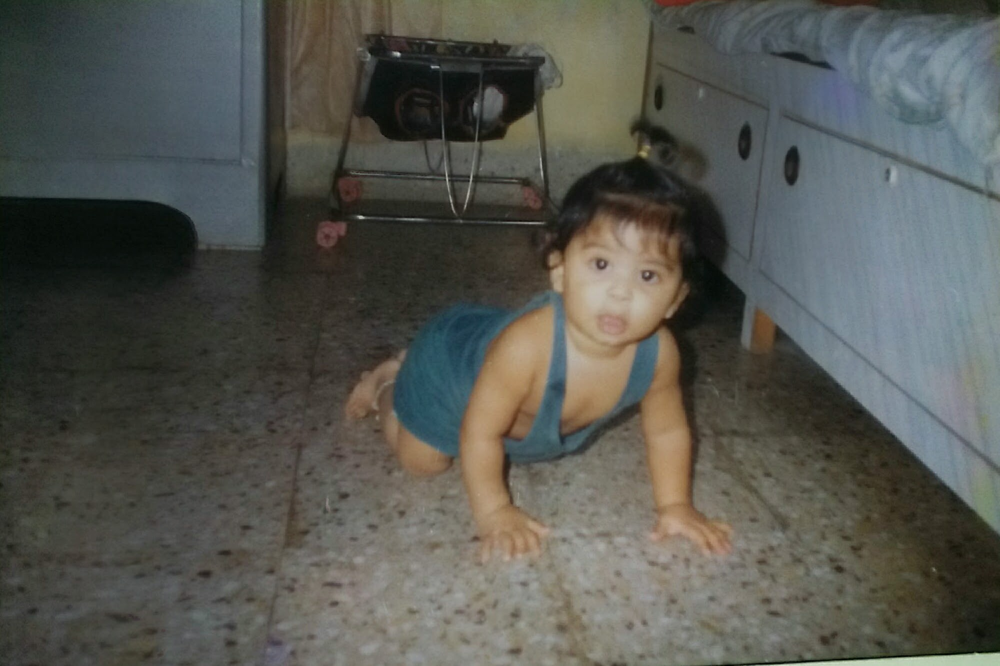
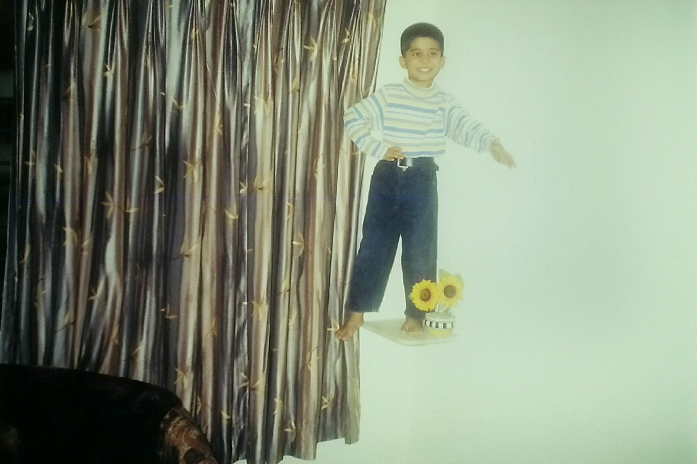
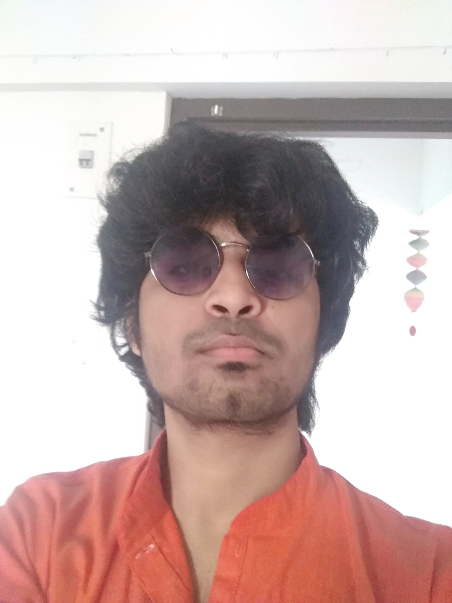
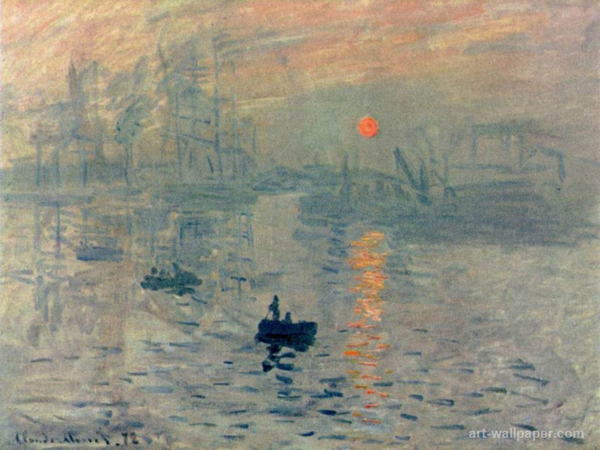
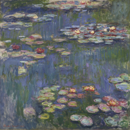

<!-- Main -->

<!-- One -->
<section id="one">
	

		<header class="major">
			<h1>About</h1>
		</header>

<!-- Content -->
<!-- <h2 id="content">Short Introduction</h2> -->

Hi! I am a final year dual degree student at the Electrical Engineering, IIT Bombay. My research interests include but aren't limited to Computational Neuroscience, Auditory Cognition, Probability Modelling, and Audio Signal Processing. I have been working with Prof.Chaporkar and Prof.Sibi at IIT Bombay on the problem of estimating the Information Transfer Rate of Auditory Stimulus. We used Mutual Information as a metric to understand the amount and the manner of representation of the tempo of the music stimulus in our brain activity. We are now working towards developing an auditory stimulus reconstruction model for music. I am also working on a collaborative project at Honda Research Institute, Japan, with Dr.Nishina on Sensory Augmentation based on Synaptic Learning. In my third year, I interned at Honda Research Institute, where I worked with Dr.Heike Brock. We worked on Sign Language Translation using Deep Neural Networks. We used the encoder-decoder models to associate the motion sequences with the text sequences. 

Looking back, my research journey looks surreal. I grew up reading biographies of scientists and always aspired to be one. The fundamental questions around us have always been a subject of fascination for me.  After 10th grade, when I was introduced to Quantum Physics, I was almost sure of pursuing a research career in theoretical physics. When the time came to choose which branch I should opt for as my major, I expressed my choice to my Physics Professor, whom I adored very much. He advised me to take Electrical Engineering instead of Engineering Physics. The latter being the one I was interested in. But I am not complaining as I enjoyed my major a lot! And I am very happy about my current research area as well! Of course, nothing is stopping me from learning more about other fields. The quest for knowledge and understanding never gets dull. It doesn't. It's actually the opposite. The more you know, the more amazing the world seems. And it's the crazy possibilities, the unanswered questions, that pull us forward.  

Since childhood, I have been a rebel, and my parents were liberal enough to allow me to ask questions and challenge them (something very rare in the country I come from). Politically, I identify myself as a socialist liberal. I am highly influenced by Noam Chomsky and his essay "The Responsibility of Intellectuals." I have written a few political blogs. Do check them out: <a href="landing.html">Posts</a>.  

I am an amateur harmonica player, and I am still learning. I enjoy reading non-fiction, classic rock, folk, trekking and astronomy along with people who enjoy my interests :)

<!-- 

	<h3>Transformation through ages</h3>
	

		

		

		

	

 -->

	<!-- Break -->
	

		<h4>Artists</h4>
		<ul>
			<li>The Beatles</li>
			<li>Bob Dylan</li>
			<li>Simon and Garfunkel</li>
			<li>Queen</li>
			<li>Lata Mangeshkar</li>
			<li>Kishore Kumar</li>
			<li>Zakir Hussein</li>
			<li>Ustad Amjad Ali Khan</li>
			<li>Pandit Ravi Shankar</li>
			<li>Anoushka Shankar</li>
		</ul>
	

	

		<h4><h3>Quote which keeps me going</h3></h4>
		<blockquote>Creating a life that reflects your values and satisfies your soul is a rare achievement. In a culture that relentlessly promotes avarice and excess as the good life, a person happy doing his own work is usually considered an eccentric, if not a subversive. Ambition is only understood if it's to rise to the top of some imaginary ladder of success. Someone who takes an undemanding job because it affords him the time to pursue other interests and activities is considered a flake. A person who abandons a career in order to stay home and raise children is considered not to be living up to his potential-as if a job title and salary are the sole measure of human worth. You'll be told in a hundred ways, some subtle and some not, to keep climbing, and never be satisfied with where you are, who you are, and what you're doing. There are a million ways to sell yourself out, and I guarantee you'll hear about them.  To invent your own life's meaning is not easy, but it's still allowed, and I think you'll be happier for the trouble.</blockquote>
		
- Bill Watterson
 
	

	<!-- Break -->
<!-- 	

		<h3>Outdoor Activities</h3>
		<ul>
			<li>Gardening</li>
			<li>Hiking</li>
		</ul>
	
	 -->

<!--  -->
<!-- <h2>Impressive Paintings</h2> -->
<!-- 

	

		

		

 -->
<!-- 		

	

 -->

<!-- 
 -->

<!-- 

	

		<h4>Social Media Profiles</h4>
		<ul class="icons">
			<li><a href="#" class="icon alt fa-github">Github</a></li>
			<li><a href="#" class="icon alt fa-facebook">Facebook</a></li>
			<li><a href="#" class="icon alt fa-instagram">Instagram</a></li>
			<li><a href="#" class="icon alt fa-twitter">Twitter</a></li>			
		</ul>
	

 -->

<!-- <h4>Left &amp; Right</h4>

Lorem ipsum dolor sit accumsan interdum nisi, quis tincidunt felis sagittis eget. tempus euismod. Vestibulum ante ipsum primis in faucibus vestibulum. Blandit adipiscing eu felis iaculis volutpat ac adipiscing accumsan eu faucibus. Integer ac pellentesque praesent tincidunt felis sagittis eget. tempus euismod. Vestibulum ante ipsum primis sagittis eget. tempus euismod. Vestibulum ante ipsum primis in faucibus vestibulum. Blandit adipiscing eu felis iaculis volutpat ac adipiscing accumsan eu faucibus. Integer ac pellentesque praesent tincidunt felis sagittis eget tempus vestibulum ante ipsum primis in faucibus magna blandit adipiscing eu felis iaculis.

Lorem ipsum dolor sit accumsan interdum nisi, quis tincidunt felis sagittis eget. tempus euismod. Vestibulum ante ipsum primis in faucibus vestibulum. Blandit adipiscing eu felis iaculis volutpat ac adipiscing accumsan eu faucibus. Integer ac pellentesque praesent tincidunt felis sagittis eget. tempus euismod. Vestibulum ante ipsum primis sagittis eget. tempus euismod. Vestibulum ante ipsum primis in faucibus vestibulum. Blandit adipiscing eu felis iaculis volutpat ac adipiscing accumsan eu faucibus. Integer ac pellentesque praesent tincidunt felis sagittis eget tempus vestibulum ante ipsum primis in faucibus magna blandit adipiscing eu felis iaculis.

 -->

</section>

